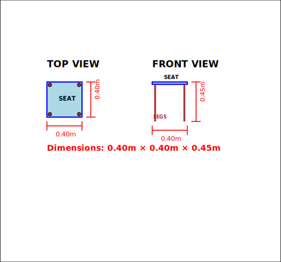
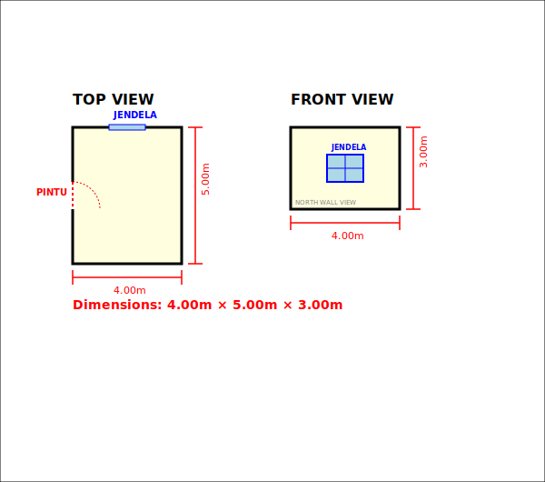
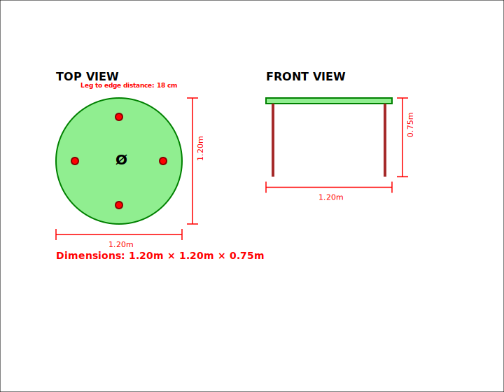
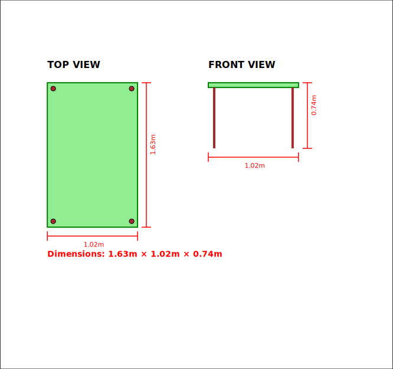
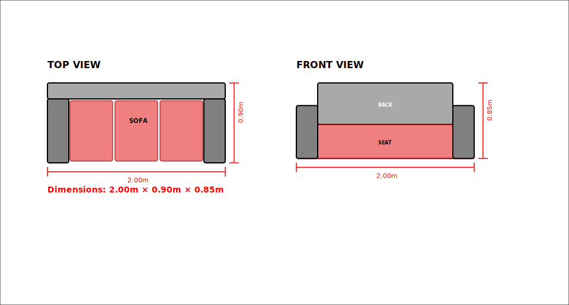
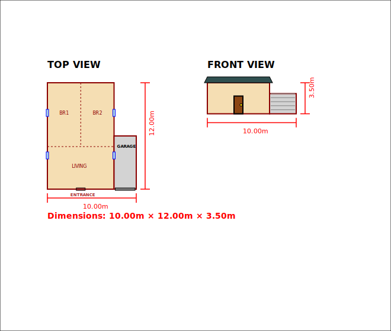

# CAD Generator with RAG + LLM

Automated CAD file generation from Indonesian natural language using hybrid LLM + RAG + Regex architecture.

**Author**: Lis Wahyuni

## Key Features

- **Hybrid NLP Parser**: Llama 3.2:1b (LLM) + Regex validation + ChromaDB RAG
- **Multi-format Output**: DXF, SVG (2D) | STL, OBJ/MTL (3D)
- **Object Types**: Chair, Table (round/rectangular), Sofa, Cabinet, Room, House
- **Indonesian Input**: Native Bahasa Indonesia with semantic translation
- **Standards-based**: Furniture dimensions from RAG knowledge base
- **Circular Geometry**: Precise circular table top & cylindrical legs

## Quick Start

```bash
# 1. Install Ollama + Llama 3.2:1b
curl -fsSL https://ollama.com/install.sh | sh
ollama pull llama3.2:1b

# 2. Clone and install dependencies
git clone https://github.com/liswahyuni/CADpython.git
cd CADpython
uv sync

# 3. Run demo (generates 35 files: 7 objects × 5 formats)
uv run demo.py

# 4. Generate 3D preview GIFs (optional - converts STL to rotating GIF animations)
uv run generate_3d_gifs.py
```

**Output**: All files saved to `demo_output/` directory

**Note**: GIF animations in examples below are generated from STL 3D files using matplotlib rendering.

## Architecture

### Pipeline Flow

```
┌─────────────────────────────────────────────────────────────────┐
│  INPUT: Indonesian Natural Language                              │
│  "Kursi 4 kaki, dudukan 40x40cm, tinggi 45cm"                  │
└───────────────────────┬─────────────────────────────────────────┘
                        │
                        ▼
┌─────────────────────────────────────────────────────────────────┐
│  STAGE 1: LLM Parser (llm_parser.py)                           │
│  • Llama 3.2:1b extracts structured JSON                       │
│  • Output: {type, dimensions, features, confidence}            │
└───────────────────────┬─────────────────────────────────────────┘
                        │
                        ▼
┌─────────────────────────────────────────────────────────────────┐
│  STAGE 2: Regex Validator (llm_parser.py)                      │
│  • Override LLM with explicit dimensions from text             │
│  • Ensures 100% accuracy for numeric values                    │
└───────────────────────┬─────────────────────────────────────────┘
                        │
                        ▼
┌─────────────────────────────────────────────────────────────────┐
│  STAGE 3: ChromaDB RAG (pdf_rag.py)                           │
│  • Semantic search: Indonesian → English standards             │
│  • Retrieve missing dimensions from knowledge base             │
└───────────────────────┬─────────────────────────────────────────┘
                        │
                        ▼
┌─────────────────────────────────────────────────────────────────┐
│  STAGE 4: 2D CAD Generation (cad_generator.py)                 │
│  • Top view + Front view with dimensions                       │
│  • Output: DXF (AutoCAD compatible) + SVG (web preview)        │
└───────────────────────┬─────────────────────────────────────────┘
                        │
                        ▼
┌─────────────────────────────────────────────────────────────────┐
│  STAGE 5: 3D Extrusion (extruder_3d.py)                        │
│  • Realistic 3D mesh with features (legs, doors, windows)      │
│  • Output: STL (3D printing) + OBJ/MTL (rendering)             │
└─────────────────────────────────────────────────────────────────┘
```

### Tech Stack

| Component | Technology | Purpose |
|-----------|-----------|---------|
| LLM | Llama 3.2:1b (Ollama) | Indonesian NLP + JSON extraction |
| Vector DB | ChromaDB + `all-MiniLM-L6-v2` | Semantic search (384-dim embeddings) |
| 2D CAD | ezdxf + svgwrite | DXF (AutoCAD) + SVG generation |
| 3D Mesh | trimesh | STL (binary) + OBJ/MTL (text) |
| 3D Preview | matplotlib + Pillow | Rotating GIF animations |

### Hybrid Parser Strategy

**Why Hybrid?** Each component handles different aspects:

| Component | Strength | Limitation |
|-----------|----------|------------|
| **LLM** | Handles ambiguity, context, inference | May hallucinate numbers |
| **Regex** | 100% accurate for explicit dimensions | Cannot understand context |
| **ChromaDB RAG** | Fast retrieval of standards | Requires knowledge base |

**Example Processing:**

```
Input: "Sofa 3 dudukan panjang 200cm"
│
├─ LLM:   {type: "sofa", length: 2.0, seats: 1}  ← Wrong seats!
├─ Regex: {seats: 3}                              ← Corrects "3 dudukan" → seats=3
└─ RAG:   {width: 0.9, height: 0.85}             ← Retrieves standards
│
Result: {type: "sofa", length: 2.0, width: 0.9, height: 0.85, seats: 3}
```

**Key Insight**: Regex overrides LLM for explicit dimensions, ensuring accuracy.

## Examples

All 7 demo examples with 2D (SVG) and 3D (GIF animation) outputs:

> **Note**: 3D GIF animations below are generated by converting STL files to rotating 360° previews using matplotlib.

### 1. Chair (4 Legs)
**Input:** `"Kursi dengan 4 kaki, dudukan persegi 40x40 cm, tinggi 45 cm"`  
**Dimensions:** 0.40m × 0.40m × 0.45m

| 2D Output (SVG) | 3D Output (GIF) |
|-----------------|-----------------|
|  |  |

### 2. Room (Door & Window)
**Input:** `"Ruangan ukuran 4x5 meter, dengan 1 pintu di sisi barat dan 1 jendela di sisi utara"`  
**Dimensions:** 4.00m × 5.00m × 3.00m

| 2D Output (SVG) | 3D Output (GIF) |
|-----------------|-----------------|
|  |  |

### 3. Round Dining Table
**Input:** `"Meja makan lingkaran diameter 120 cm dengan 4 kaki, tinggi 75 cm"`  
**Dimensions:** Ø1.20m × 0.75m

| 2D Output (SVG) | 3D Output (GIF) |
|-----------------|-----------------|
|  |  |

### 4. Dining Table (6 People)
**Input:** `"Meja makan untuk 6 orang"`  
**Dimensions:** 1.63m × 1.02m × 0.74m (from ChromaDB standards)

| 2D Output (SVG) | 3D Output (GIF) |
|-----------------|-----------------|
|  |  |

### 5. Three-Seat Sofa
**Input:** `"Sofa 3 dudukan dengan sandaran dan lengan, panjang 200 cm lebar 90 cm tinggi 85 cm"`  
**Dimensions:** 2.00m × 0.90m × 0.85m

| 2D Output (SVG) | 3D Output (GIF) |
|-----------------|-----------------|
|  |  |

### 6. Wardrobe (2 Doors)
**Input:** `"Lemari pakaian 2 pintu, ukuran 120x60 cm, tinggi 200 cm"`  
**Dimensions:** 1.20m × 0.60m × 2.00m

| 2D Output (SVG) | 3D Output (GIF) |
|-----------------|-----------------|
|  |  |

### 7. Modern House (with Garage & Windows)
**Input:** `"Rumah modern 10x12 meter dengan garasi, 2 kamar tidur, 4 jendela, tinggi 3.5 meter"`  
**Dimensions:** 10.00m × 12.00m × 3.50m

| 2D Output (SVG) | 3D Output (GIF) |
|-----------------|-----------------|
|  |  |

## Project Structure

```
CADpython/
├── demo.py              # Main demo + pipeline orchestrator
├── llm_parser.py        # Llama 3.2 parser
├── pdf_rag.py           # ChromaDB RAG system
├── cad_generator.py     # 2D DXF/SVG generation
├── extruder_3d.py       # 3D STL/OBJ generation
├── generate_3d_gifs.py  # STL to GIF converter
├── pyproject.toml       # Dependencies
├── demo_output/         # Generated files
│   ├── *.dxf            # 2D CAD files
│   ├── *.svg            # 2D vector graphics
│   ├── *.stl            # 3D models (binary)
│   ├── *.obj *.mtl      # 3D models (text + materials)
│   └── gifs/            # 3D preview animations
│       └── *.gif        # Rotating 3D previews
└── rag_documents/       # PDF knowledge base
    └── chroma_db/       # ChromaDB persistent storage
```

## References

**Core Libraries:**
- [Ollama](https://ollama.com/) - Local LLM inference engine
- [Llama 3.2](https://ollama.com/library/llama3.2) - 1B parameter language model
- [ChromaDB](https://www.trychroma.com/) - Vector database for RAG
- [Sentence Transformers](https://www.sbert.net/) - Embedding models (`all-MiniLM-L6-v2`)

**CAD & 3D Processing:**
- [ezdxf](https://ezdxf.readthedocs.io/) - DXF file generation (AutoCAD format)
- [svgwrite](https://svgwrite.readthedocs.io/) - SVG vector graphics
- [trimesh](https://trimsh.org/) - 3D mesh processing (STL/OBJ)
- [matplotlib](https://matplotlib.org/) - 3D visualization
- [Pillow](https://pillow.readthedocs.io/) - Image processing for GIF generation

**Supporting:**
- [PyPDF2](https://pypdf2.readthedocs.io/) - PDF text extraction
- [NumPy](https://numpy.org/) - Numerical computing
